<div align="center">

# EmotiCare

### AI-Powered Emotional and Mental Health Support Platform

**Human-Centered Technology • Digital Emotional Care • AI-Assisted Analysis**

[Visit EmotiCare](https://emoticare.upnm.edu.my)

</div>

---

## About EmotiCare

EmotiCare is a web-based emotional and mental health support platform designed to provide accessible, user-centered digital support for students, staff, and organisations.

The platform integrates emotional assessments, mood monitoring, digital journaling, AI-assisted emotional analysis, wellness activities, emotional progress tracking, and support mechanisms within a unified digital environment.

> **Our Goal:** Technology that supports people, not replaces people.

---

## Platform at a Glance

| Area | Description |
|---|---|
| **Platform** | Web-based emotional and mental health support platform |
| **Target Users** | Students, staff, organisations and institutions |
| **Core Functions** | Assessment, mood monitoring, journaling, wellness activities and emotional support |
| **AI/ML** | Language processing, sentiment analysis and emotion classification |
| **Access** | Responsive web interface |
| **Institution** | Universiti Pertahanan Nasional Malaysia (UPNM) |
| **Website** | [emoticare.upnm.edu.my](https://emoticare.upnm.edu.my) |

---

## Key Features

### 1. Emotional Assessments

EmotiCare provides structured emotional and psychological assessment modules, including:

- DASS-21
- SSEIT

Assessment results are presented through user-friendly interfaces to support emotional self-awareness and continuous monitoring.

### 2. Mood Check-In

The Mood Check-In feature allows users to record their current emotional state and monitor emotional changes over time.

This supports:

- Emotional self-monitoring
- Recent mood tracking
- Emotional reflection
- Personalised platform interaction

### 3. Digital Journaling

EmotiCare provides a digital journaling environment where users can record personal reflections and emotional experiences.

Journal entries can be processed through the AI-assisted emotional analysis workflow to support emotional understanding and appropriate digital support.

### 4. AI-Assisted Emotional Analysis

The platform incorporates an AI-assisted text analysis workflow involving:

- Language detection
- Translation when required
- Sentiment analysis
- Text feature extraction
- Emotion classification
- Intervention determination

### 5. Wellness Activities

EmotiCare provides wellness-oriented activities designed to support emotional well-being and continued engagement with the platform.

### 6. Mind Games

Interactive mind games provide users with an additional form of engagement as part of the EmotiCare digital experience.

### 7. Emotional Progress and Results

Users can review their assessment results and emotional information through dedicated result interfaces.

This enables users to observe their emotional information over time rather than relying on a single interaction.

### 8. Support Mechanisms

EmotiCare provides pathways for users to access appropriate emotional and counselling support when required.

### 9. Responsive Web Experience

EmotiCare is designed as a responsive web platform accessible through:

- Desktop
- Tablet
- Mobile devices

No separate mobile application is required.

---

## 🖥️ EmotiCare Interface Showcase

The following screenshots demonstrate the implemented EmotiCare web platform, covering authentication, emotional monitoring, assessments, journaling, wellness activities, results, and administrative management.

### 🔐 Authentication

<table>
<tr>
<td width="50%" align="center">
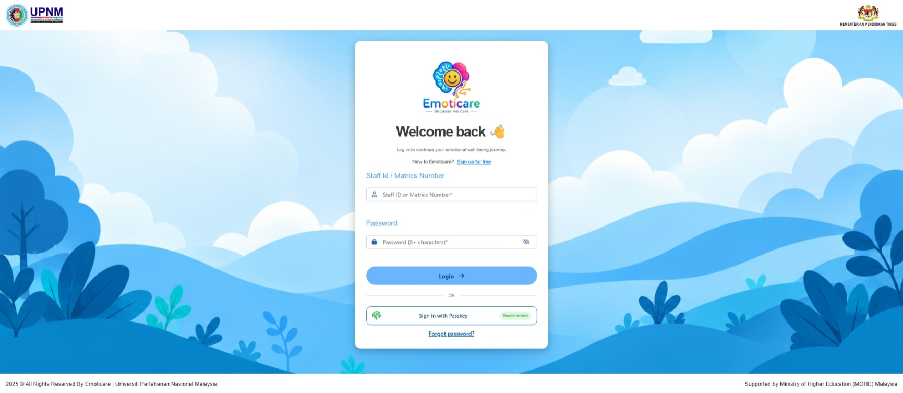
<br><b>Login</b>
</td>
<td width="50%" align="center">
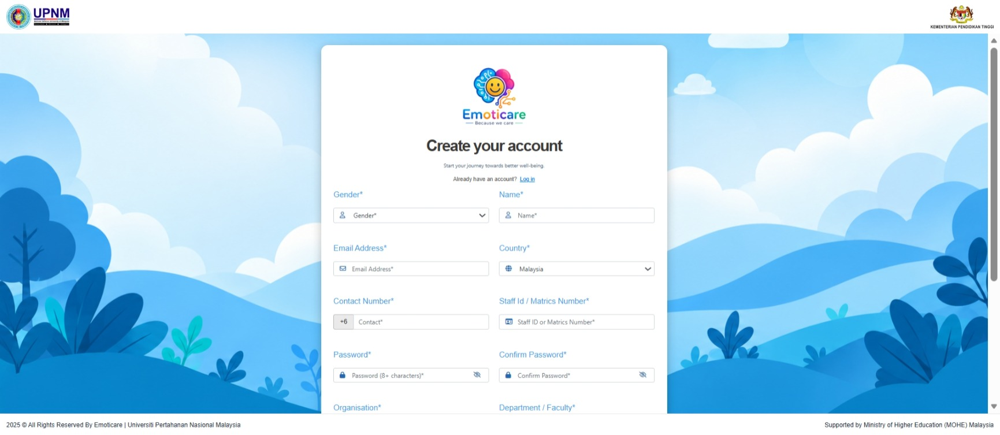
<br><b>Registration</b>
</td>
</tr>
</table>

### 🏠 Main User Experience

<table>
<tr>
<td width="50%" align="center">
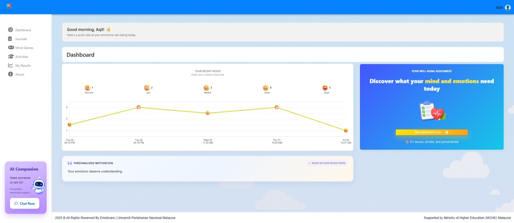
<br><b>Main Dashboard</b>
</td>
<td width="50%" align="center">
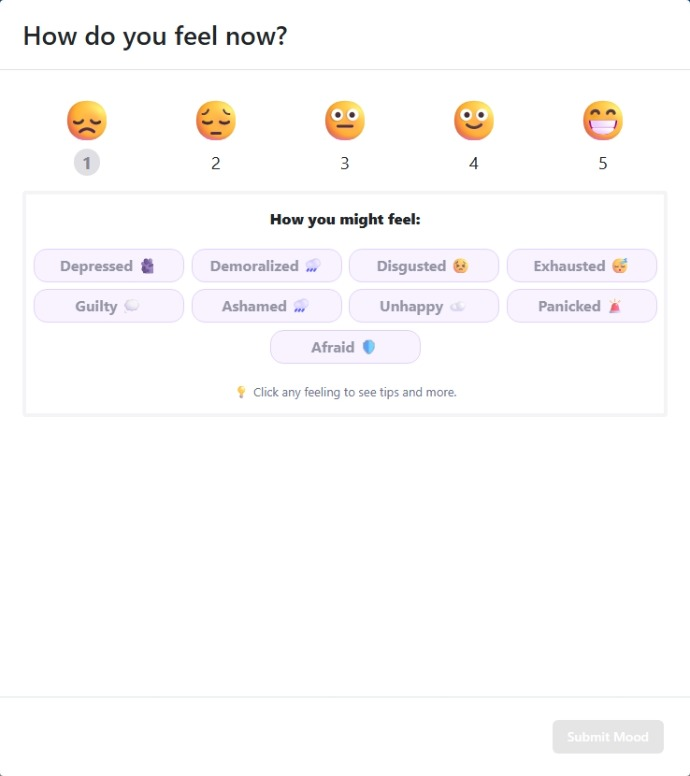
<br><b>Mood Check-In</b>
</td>
</tr>
</table>

### 🧠 Emotional Assessment

<table>
<tr>
<td width="50%" align="center">
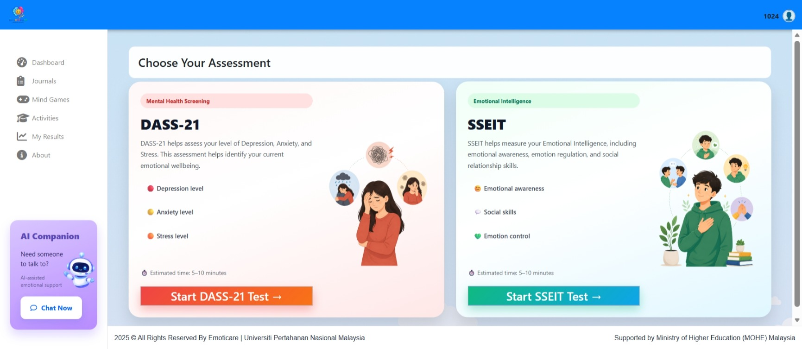
<br><b>Emotional Assessment</b>
</td>
<td width="50%" align="center">
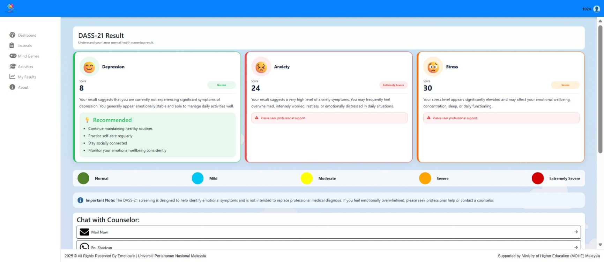
<br><b>DASS-21 Result</b>
</td>
</tr>

<tr>
<td width="50%" align="center">
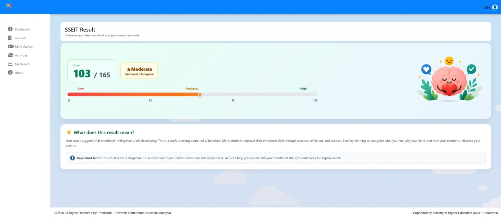
<br><b>SSEIT Result</b>
</td>
<td width="50%" align="center">
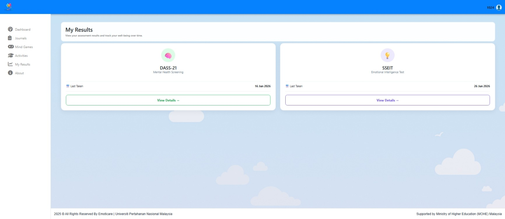
<br><b>Result Hub</b>
</td>
</tr>
</table>

### 📔 Journaling & Emotional Reflection

<table>
<tr>
<td width="50%" align="center">
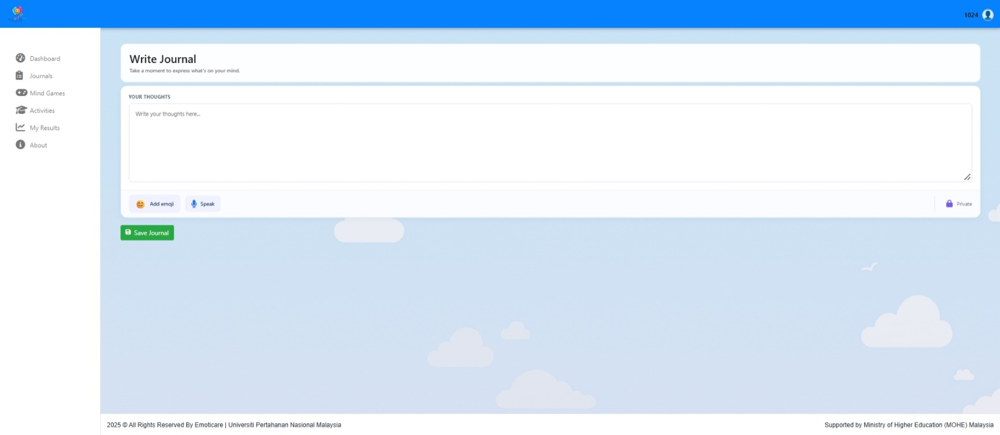
<br><b>Reflective Journal</b>
</td>
<td width="50%" align="center">
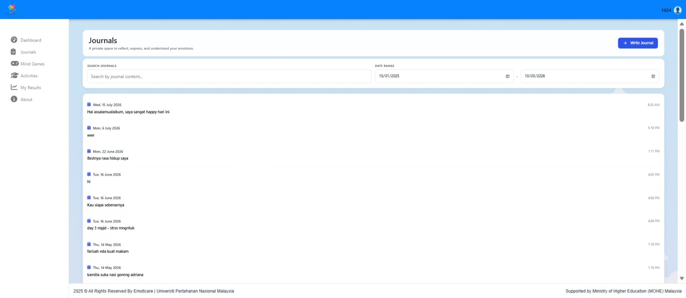
<br><b>Journal History</b>
</td>
</tr>
</table>

### 🌱 Wellness & Engagement

<table>
<tr>
<td width="50%" align="center">
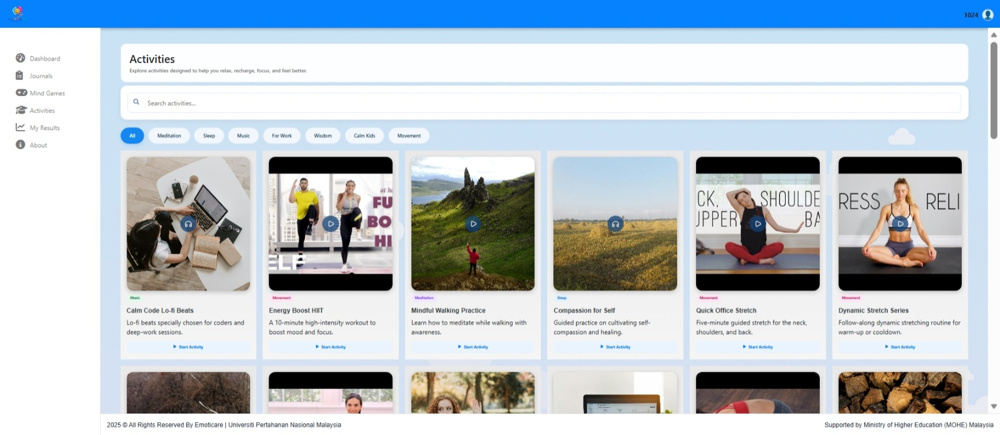
<br><b>Activity Hub</b>
</td>
<td width="50%" align="center">
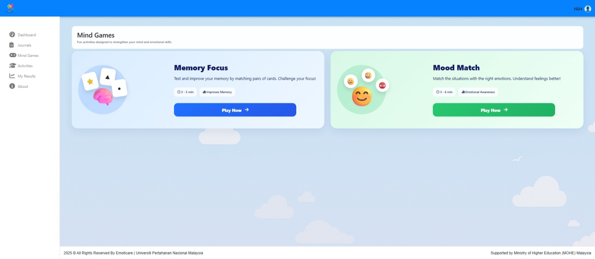
<br><b>Game Hub</b>
</td>
</tr>
</table>

### 👤 User Profile

<table>
<tr>
<td width="50%" align="center">
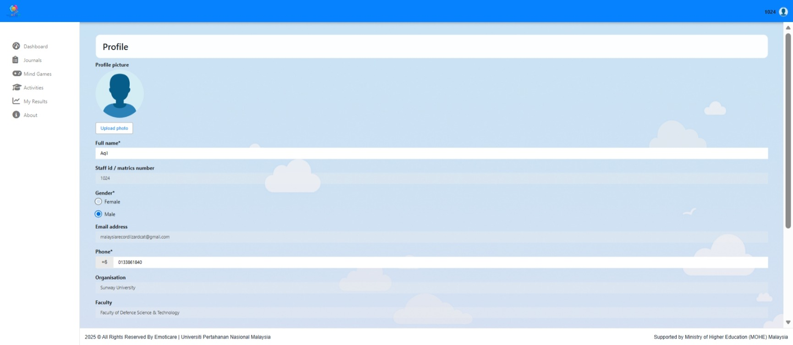
<br><b>User Profile</b>
</td>
<td width="50%"></td>
</tr>
</table>

### ⚙️ Administration

<table>
<tr>
<td width="50%" align="center">
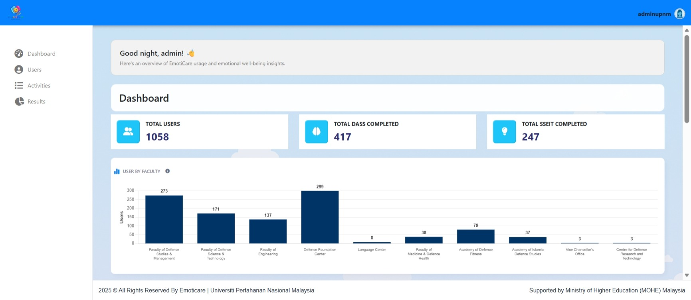
<br><b>Admin Dashboard</b>
</td>
<td width="50%" align="center">
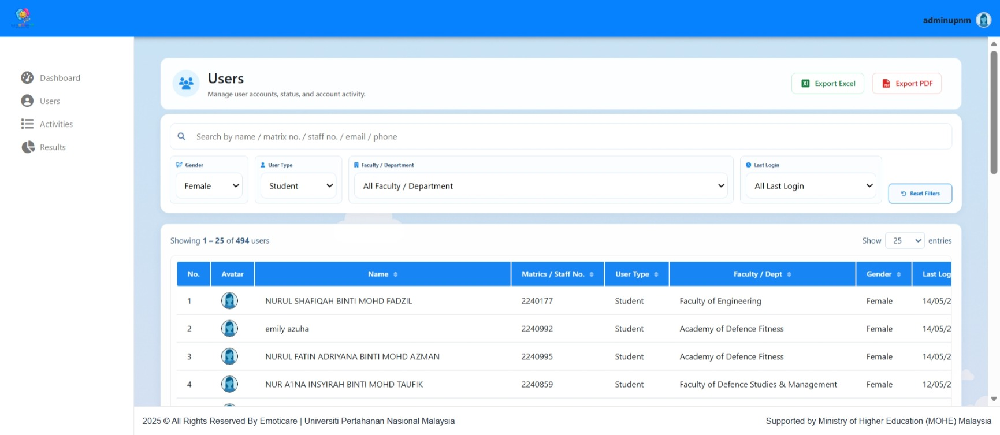
<br><b>Users Management</b>
</td>
</tr>

<tr>
<td width="50%" align="center">
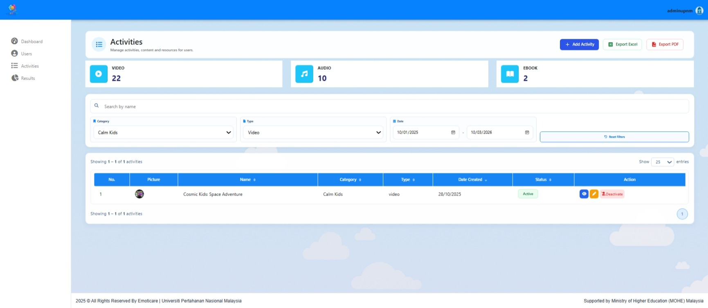
<br><b>Activities Management</b>
</td>
<td width="50%" align="center">
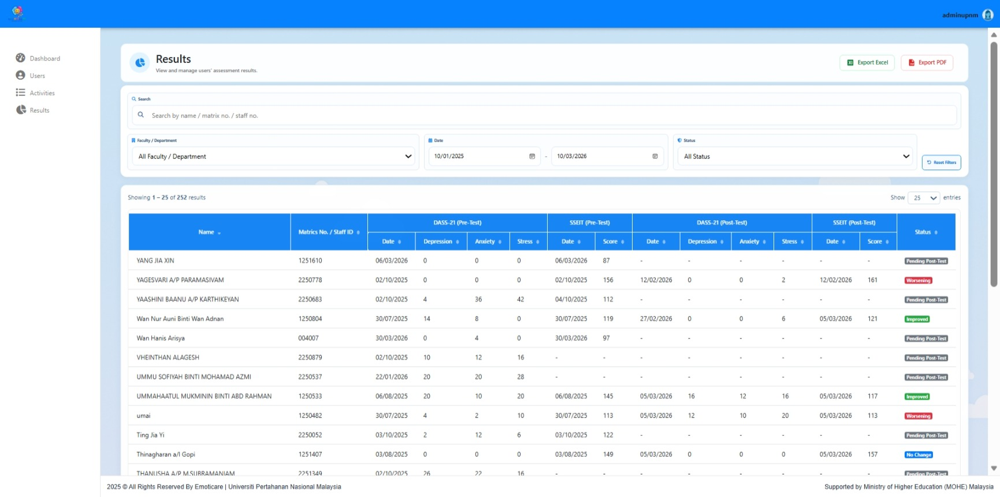
<br><b>Results Management</b>
</td>
</tr>
</table>

---

## How EmotiCare Works

A typical user journey within EmotiCare can be represented as:

```text
User
  │
  ▼
Mood Check-In
  │
  ▼
Emotional Assessment
  │
  ▼
Digital Journaling
  │
  ▼
AI-Assisted Emotional Analysis
  │
  ▼
Emotional Insights
  │
  ▼
Wellness & Support
```

The platform is designed to provide multiple connected emotional-care functions within a single digital environment.

---

## Technology Overview

| Component | Technologies |
|---|---|
| **Web Application** | PHP, HTML, CSS, JavaScript |
| **Database** | MySQL |
| **AI Service** | Python, Flask |
| **Language Processing** | Language Detection and Translation |
| **Sentiment Analysis** | VADER |
| **Feature Extraction** | TF-IDF |
| **Emotion Classification** | Logistic Regression |
| **Authentication** | Session Authentication and Passkey / WebAuthn |

For further technical information, see the [Technology Stack](docs/technology-stack.md).

---

## System Architecture

EmotiCare uses a modular architecture that connects the user-facing web application with data management and AI-assisted emotional analysis components.

```text
                    ┌─────────────────────┐
                    │        User         │
                    └──────────┬──────────┘
                               │
                               ▼
                    ┌─────────────────────┐
                    │     Web Browser     │
                    └──────────┬──────────┘
                               │
                               ▼
                  ┌─────────────────────────┐
                  │ EmotiCare Web Platform  │
                  └────────────┬────────────┘
                               │
                  ┌────────────┴────────────┐
                  │                         │
                  ▼                         ▼
        ┌─────────────────┐       ┌─────────────────┐
        │ MySQL Database  │       │ Python AI       │
        │                 │       │ Service         │
        └─────────────────┘       └─────────────────┘
```

More information is available in the [System Architecture Documentation](docs/system-architecture.md).

---

## AI-Assisted Emotional Analysis

The current EmotiCare emotional analysis workflow follows the general process below:

```text
Journal Input
      │
      ▼
Language Detection
      │
      ▼
Translation
(when required)
      │
      ▼
Sentiment Analysis
      │
      ▼
Feature Extraction
      │
      ▼
Emotion Classification
      │
      ▼
Intervention Type
```

The current workflow incorporates language processing, VADER sentiment analysis, TF-IDF feature extraction, and Logistic Regression-based emotion classification.

Further details are available in the [AI Workflow Documentation](docs/ai-workflow.md).

---

## Pseudocode

High-level pseudocode is provided to illustrate selected EmotiCare workflows without exposing production source code or sensitive implementation details.

### Available Pseudocode

- [Journal Emotional Analysis](pseudocode/journal-analysis.md)
- [Mood Tracking](pseudocode/mood-tracking.md)
- [Emotional Assessment](pseudocode/assessment.md)
- [User Authentication](pseudocode/authentication.md)

> **Note:** The pseudocode represents conceptual system logic and is not production source code.

---

## Documentation

Additional project documentation is available within this repository.

| Document | Description |
|---|---|
| [Visual Overview (PDF)](Visual-Overview.pdf)
| [System Architecture](docs/system-architecture.md) | High-level platform architecture and component interaction |
| [Features](docs/features.md) | Overview of major EmotiCare functions |
| [Technology Stack](docs/technology-stack.md) | Technologies used by the platform |
| [AI Workflow](docs/ai-workflow.md) | AI-assisted emotional analysis workflow |

---

## Human-Centered Technology

EmotiCare follows a human-centered approach to digital emotional care.

The platform combines:

**ASSESS + MONITOR + ANALYSE + SUPPORT**

within one integrated digital experience.

The platform is designed around the principle that technology should assist users in understanding and monitoring their emotional well-being while maintaining appropriate pathways to human support.

---

## Privacy and Security

EmotiCare incorporates security and privacy considerations within the platform architecture.

Selected mechanisms include:

- User authentication
- Account verification
- Login attempt controls
- Session management
- Session timeout
- Passkey / WebAuthn support
- Protected journal content

Detailed production security configurations are intentionally not disclosed in this repository.

---

## Repository Scope

This repository is intended to provide a high-level representation of the EmotiCare project through:

- Project documentation
- System architecture
- Technology information
- AI workflow documentation
- Pseudocode
- Interface screenshots

This repository does **not** provide the production source code of EmotiCare.

---

## Repository Notice

The following production components are intentionally excluded from this repository:

- Production source code
- Database credentials
- API credentials
- Encryption keys
- Server configuration
- Security-sensitive implementation details
- Private user information
- Sensitive production data

The documentation and pseudocode contained in this repository are intended to communicate the system concept, architecture, workflow, and technical approach without exposing proprietary implementation details.

---

## Intellectual Property Notice

EmotiCare is a proprietary research and development project.

Unless otherwise stated, the materials contained in this repository are provided for project demonstration, documentation, and evaluation purposes and may not be copied, modified, redistributed, or used for commercial purposes without prior permission from the project owner.

All trademarks, logos, institutional identities, third-party libraries, models, and technologies remain the property of their respective owners.

---

## Project Information

**Project:**  
EmotiCare: An AI-Powered Emotional Intelligence App for a Next-Generation Digital Counseling Experience

**Institution:**  
Universiti Pertahanan Nasional Malaysia (UPNM)

**Website:**  
[https://emoticare.upnm.edu.my](https://emoticare.upnm.edu.my)

---

<div align="center">

### EmotiCare

**Technology that supports people, not replaces people.**

</div>